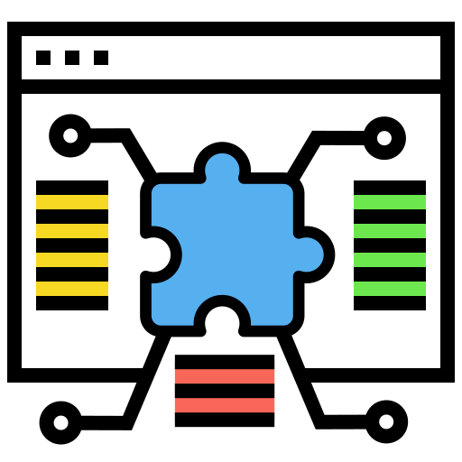

<div align="center">
<p></p>

# webextension-store-meta

[](https://awesome-webextension.github.io/webextension-store-meta/)
[](https://www.npmjs.com/package/webextension-store-meta)
[](https://github.com/awesome-webextension/webextension-store-meta/actions/workflows/build.yml)


</div>

Get browser extension(webextension) item meta from Chrome Web Store and Firefox add-ons.

This lib uses many fallback methods to improve stability and performance.

## Who Use It

<table>
  <tbody>
    <tr>
      <td align="center">
        
    </td>
      <td align="center">
        
      </td>
    </tr>
    <tr>
      <th align="center">
        <a href="https://shields.io/">Shields.io</a>
      </th>
      <th align="center">
        <a href="https://badgen.net/chrome-web-store">Badgen</a>
      </th>
    </tr>
    <tr>
      <td align="center">
        Quality metadata badges <br>for open source projects
      </td>
      <td align="center">
        Fast badge generating service
      </td>
    </tr>
  <tbody>
</table>

## Installation

npm

```bash
npm add webextension-store-meta
```

## Usage

```js
const { ChromeWebStore } = require('webextension-store-meta/lib/chrome-web-store')
const chromeWebStore = await ChromeWebStore.load({
  id: 'xxxxxxx',
  qs: { hl: 'en' },
})
console.log(chromeWebStore.meta())

const { Amo } = require('webextension-store-meta/lib/amo')
const amo = await Amo.load({ id: 'xxxxxxx' })
console.log(amo.meta())
```

Get individual property:

```js
const { Amo } = require('webextension-store-meta/lib/amo')
const amo = await Amo.load({ id: 'xxxxxxx' })
console.log(amo.name())
console.log(amo.ratingValue())
```

Load config:

- **id** `{string}` _required_ - extension id.
- **qs** `{string|object}` _optional_ - querystring.
- **options** `object` _optional_ - [undici.fetch options](https://undici.nodejs.org/#/?id=undicifetchinput-init-promise).

## Development

```bash
git clone https://github.com/awesome-webextension/webextension-store-meta.git
cd webextension-store-meta
npm i
npm test
```
